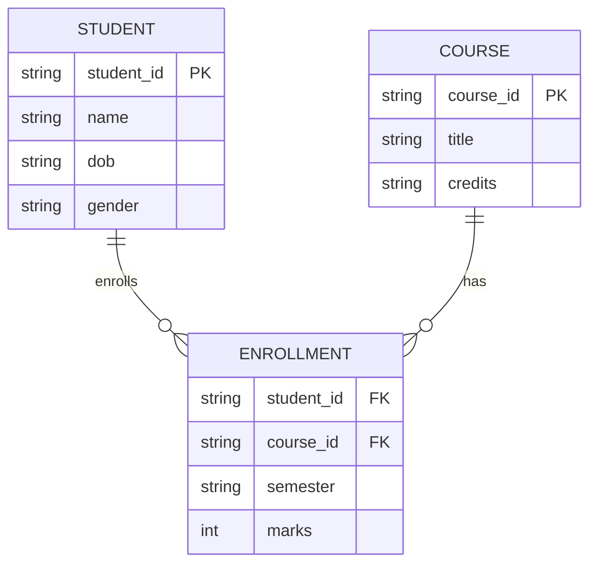

<pre>

```mermaid
erDiagram
    STUDENT ||--o{ ENROLLMENT : enrolls
    COURSE ||--o{ ENROLLMENT : has
    STUDENT {
        string student_id PK
        string name
        string dob
        string gender
    }
    COURSE {
        string course_id PK
        string title
        string credits
    }
    ENROLLMENT {
        string student_id FK
        string course_id FK
        string semester
        int marks
    }
```
</pre>
